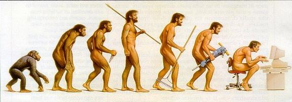

# 欢迎来到编程的世界

## TL;DR

* **计算机**是一个能够快速且无缝执行一系列给予它的指令的机器。

* **程序** 是给予计算机的一个指令列表。这些指令以文本的形式存在，所有这些指令组成了程序的**源代码**。

* **程序员**的任务是创建程序。为了达成这个目标，他需要掌握不同的编程语言。

* 在编写代码之前，一个人需要提前想好并分解他的问题。这个问题被分解成一系列的基础步骤的过程就称为**算法**。

## 什么是程序？



自从上个世纪50年代计算机被发明以来，**计算机**给我们的日常生活带来了革命性的改变。通过网站或者 GPS 计算路径， 订火车票或飞机票， 和地球另一边的朋友闲聊等，这些都要归功于计算机。

I> 这里指的是广义概念上的“计算机”，也就是一台能够执行酸雨和逻辑操作的机器。它可能是一个台式机或者笔记本电脑(PC, Mac), 服务器， 或者是像平板或者智能手机这样的移动设备。

虽然计算机很强大，但是它只能执行一系列事先确定好的指令。它们没有学习、判断或者即兴发挥的能力。它们只能做被要求做的事！计算机的价值来自于它们能够非常快速的处理大量的信息。

计算机经常需要人工的介入，这也是程序员发挥价值的地方。程序员编写程序来指导计算机进行工作。

**计算机程序**（也叫做应用或软件）是一些列文本文件的组合。这些文件以程序(code)的形式包含了指导计算机进行工作的命令。这也是为什么开发者也被称为coder。

**编程语言** 是给予计算机命令的一种方式。它和人类的语言类似。每一种编程语言都有关键词（每个关键词有特定的功能）和语法（定义了如何使用这种语言来编程）。

## 如何编写程序？

### 最接近硬件的语言: 汇编语言

唯一能够被计算机直接理解的语言就是机器语言。一种比较易读的机器语言是**汇编语言**。它由一些比较原始的指令构成，这些指令和特定的处理器（计算机的大脑）家族相关联，可以操作计算机的内存。

下面是用汇编语言编写的一个简单的程序示例，它能够对用户显示`"Hello"`

```assembly
str:
    .ascii "Hello\n"
    .global _start

_start:
movl $4, %eax
movl $1, %ebx
movl $str, %ecx
movl $8, %edx
int $0x80
movl $1, %eax
movl $0, %ebx
int $0x80
```

是不是非常吓人？幸运的是，其他语言要比汇编语言简单的多，也更易于使用。